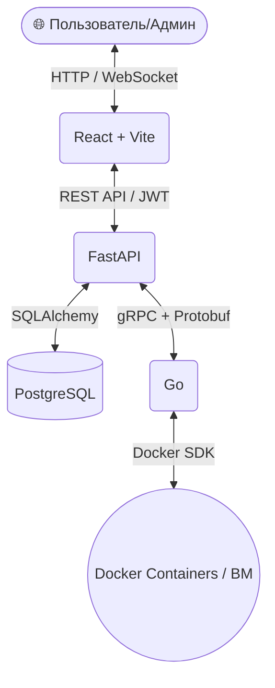

<div align="center">
  
  
  # ☁️ Тучка МТС — Облачная Платформа (IaaS)
  
  **Полнофункциональная облачная инфраструктура как услуга с мультитенантностью, биллингом и веб-терминалом**
  
  
  
  
  
  
  
  
  

</div>

---

## 📋 О проекте

**Тучка МТС** — это мощная IaaS (Infrastructure as a Service) платформа, разработанная для предоставления виртуальной вычислительной инфраструктуры компаниям и индивидуальным пользователям. Платформа обладает современным веб-интерфейсом для управления виртуальными машинами (через Docker-контейнеры), встроенным биллингом реального времени и системой квот для разных организаций (Multitenancy).

Проект состоит из микросервисной архитектуры: современного **SPA-фронтенда**, **REST API Control Plane** на FastAPI и низкоуровневой **Compute Node** на Go с использованием gRPC для коммуникации.

---

## ✨ Главные фичи

* 🖥️ **Жизненный цикл ВМ:** Создание (с выбором ОС Ubuntu/Alpine/Debian/Nginx), старт, стоп, гибернация, бэкапы, восстановление и удаление.
* 💰 **Биллинг:** Детализированная поминутная тарификация vCPU, RAM и Storage с удобным калькулятором цен в момент создания ВМ и графическим дашбордом расходов.
* 🔐 **Мультитенантность:** Полная изоляция тенантов (организаций). Проработанная ролевая система, квотирование ресурсов и система запросов на доступ к мощностям.
* 📊 **Live Мониторинг:** Реалтайм-графики загрузки CPU, RAM в панели управления на базе Recharts и мониторинг всего кластера для администраторов.
* 💻 **Web-Console (SSH):** Встроенный терминал прямо в браузере (xterm.js) с доступом к запущенным машинам через WebSocket! Никаких дополнительных SSH-клиентов. 
* 📸 **Снапшоты (Бэкапы):** Возможность делать "снимки" состояния машины и восстанавливаться к любому сохраненному моменту в один клик.
* 🛡️ **Админ Панель:** Глобальный мониторинг вычислительных нод, управление тенантами, финансовые отчеты и массовые экстренные акции (Stop All, Delete by OS).

---

## 🏗️ Архитектура



---

## 🚀 Быстрый старт

### Требования
* **Docker** и **Docker Compose**
* **Python 3.10+** (Опционально, для запуска локального скрипта сидирования БД)
* **Node.js 18+** (Опционально, для локальной разработки фронтенда)

### Запуск всего кластера 

1. Клонируйте репозиторий:
   ```bash
   git clone https://github.com/your-username/hackaton-iaas.git
   cd hackaton-iaas
   ```

2. Запустите оркестрацию микросервисов через Docker Compose:
   ```bash
   docker-compose up --build -d
   ```

3. Заполните базу данных начальными данными (моковыми пользователями, тенантами, настройками биллинга):
   ```bash
   # Либо запустите скрипт через контейнер
   docker-compose exec control-plane python seed.py
   
   # Либо локально, если установлен python и зависимости
   # python control-plane/seed.py
   ```

4. 🌐 **Перейдите в веб-интерфейс!**
   Приложение будет доступно по адресу (порт фронтенда, если он раздается сервером или `localhost:5173` если запущен локально):
   - Разработка UI локально:
     ```bash
     cd frontend
     npm install
     npm run dev
     ```

---

## 📁 Структура проекта

* `frontend/` — **Пользовательский и Админский интерфейс** (React, TailwindCSS, xterm.js для терминала)
* `control-plane/` — **Бэкенд сервис / API** (Python, FastAPI, SQLAlchemy async, JWT Authentication)
* `compute-node/` — **Воркер вычислительной ноды** (Go, gRPC Server, взаимодействие с Docker SDK для оркестрации инстансов)
* `proto/` — **gRPC контракты** (`cloud.proto`), описывающие интерфейсы общения между Control Plane и Compute Node
* `docker-compose.yml` — Инфраструктура в виде кода для запуска всего стека разом.

---

## 🤝 Контакты / Поддержка

Проект разработан в рамках хакатона. По всем вопросам (в рамках демо: подключение клиентов, биллинг) можно обращаться через дашборд приложения во вкладке "Контакты". 

**IaaS — Инфраструктура, которой вы доверяете.**

<div align="center">
  <sub>Сделано с ❤️ для <a href="https://mts.ru">МТС</a></sub>
</div>
